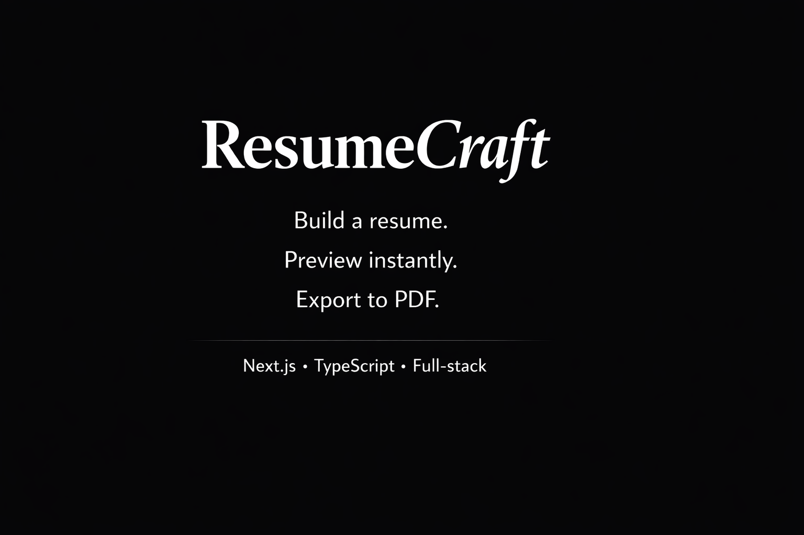
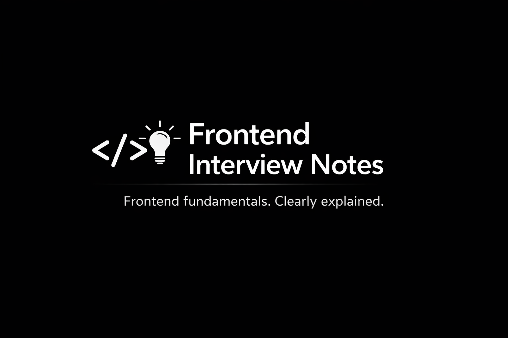

### Frontend Developer (React / Next.js)

I design and build product interfaces with a strong focus on UX, structure,
and long-term maintainability.
Most of my work involves dashboards, admin panels, and e-commerce products
with complex state and real users.

Currently:

- building data-heavy dashboards and admin panels
- working on e-commerce interfaces and conversion-focused product flows

## Featured project

### ResumeCraft // Side project

ATS-friendly resume builder with clean typography and structured layouts,
designed to be readable in under 10 seconds.

**Stack:** Next.js, TypeScript, Tailwind CSS, PDF generation

PDF / DOCX • Minimal UI • Product-first UX

[ResumeCraft](https://github.com/denyydev/resume-craft)

### Frontend Interview Notes // Community project

Community-driven frontend knowledge base.
Created to help developers understand fundamentals,
not to memorize interview answers.

JavaScript • React • Browser internals • Performance

[Frontend Interview Notes](https://github.com/denyydev/frontend-interview-notes)

## What I work on

- Dashboards and analytics interfaces
- Admin panels and internal tools
- E-commerce frontends and product flows

## Tech stack

- **Frontend:** React, Next.js, TypeScript
- **Styling:** Tailwind CSS
- **State management:** Redux Toolkit, Zustand
- **UI & UX:** component systems, accessibility, product thinking

## Approach

I prefer fewer features, clearer structure, and predictable behavior
over visual noise. My goal is to reduce cognitive load, not add more UI.

## Contact

- Telegram: @denyydev
- Email: denyspolehenky@gmail.com
